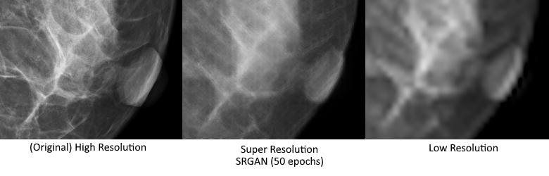

# ASMR: A Super Mammography Resolution project

A collection of deep learning models for mammography image super-resolution using PyTorch Lightning. This repository implements multiple state-of-the-art super-resolution architectures:

- SRCNN (Super-Resolution Convolutional Neural Network)
- SRGAN (Super-Resolution Generative Adversarial Network)
- ESRGAN (Enhanced Super-Resolution Generative Adversarial Network)

## Example Results



*Left: Original high-resolution mammogram, Middle: Super-resolution result using SRGAN (50 epochs), Right: Low-resolution input after bicubic interpolation*

The example above demonstrates the model's ability to enhance low-resolution mammography images, recovering detailed tissue structures and improving image clarity.

## Features

- Implementation of multiple popular super-resolution architectures
- PyTorch Lightning-based training for efficient code organization and training
- Support for 8x upscaling of mammography images
- Grayscale image processing optimized for medical imaging
- Inference scripts for easy model deployment
- Comparison tools for evaluating different super-resolution approaches

## Installation

```bash
git clone https://github.com/yourusername/ASuperMammoResolution.git
cd ASuperMammoResolution
```

First, install Pytorch from their [website]( https://pytorch.org/get-started/locally/)
```bash
pip3 install torch torchvision --index-url https://download.pytorch.org/whl/cu118
```

Then, install the required libraries from the [requirements file](requirements.txt).
```bash
pip install -r requirements.txt
```

## Dataset Structure

The dataset should be organized in the following structure:
```
mammography_sr_dataset/
├── train/
│   ├── low_res/
│   └── high_res/
└── val/
    ├── low_res/
    └── high_res/
```

## Training

Each model can be trained separately using its respective training script:

```bash
# Train SRCNN
python srcnn.py

# Train SRGAN
python srgan.py

# Train ESRGAN
python esrgan.py
```

## Inference

To perform inference with a trained model, use the corresponding inference script:

```bash
# SRGAN inference
python srgan_infer.py --checkpoint path/to/checkpoint.ckpt \
                      --input_dir path/to/input/images \
                      --output_dir path/to/output \
                      --compare

# ESRGAN inference
python esrgan_infer.py --checkpoint path/to/checkpoint.ckpt \
                       --input_dir path/to/input/images \
                       --output_dir path/to/output \
                       --compare
```

### Inference Arguments

- `--checkpoint, -p`: Path to the model checkpoint
- `--input_dir, -i`: Directory containing input images
- `--output_dir, -o`: Directory to save super-resolved images
- `--compare, -c`: Flag to save side-by-side comparisons of input and output

## Model Architecture Details

### SRCNN
- Simple CNN architecture
- Three convolutional layers
- MSE loss function
- Bicubic upsampling preprocessing

### SRGAN
- Generator with residual blocks
- Discriminator for adversarial training
- Perceptual, content, and adversarial losses
- 8x upscaling using pixel shuffle

### ESRGAN
- Enhanced SRGAN architecture
- Residual-in-Residual Dense Block (RRDB)
- Relativistic average GAN loss
- Improved perceptual loss

## Requirements

The main dependencies are:
- PyTorch
- PyTorch Lightning
- MONAI
- Pillow
- tqdm

For a complete list of dependencies, see [`requirements.txt`](requirements.txt).

## License

[MIT Licence](LICENSE)

## Citation

If you use this code in your research, please cite it as follows:

### BibTeX
```bibtex
@software{ASuperMammoResolution2024,
  author = {[Pierre LE NOST]},
  title = {ASuperMammoResolution: Deep Learning Models for Mammography Super-Resolution},
  year = {2024},
  publisher = {GitHub},
  journal = {GitHub repository},
  url = {https://github.com/yourusername/ASuperMammoResolution}
}
```

### APA
```
[Pierre LE NOST]. (2024). ASuperMammoResolution: Deep Learning Models for Mammography Super-Resolution [Computer software]. GitHub. https://github.com/yourusername/ASuperMammoResolution
```

### Chicago
```
[Pierre LE NOST]. 2024. "ASuperMammoResolution: Deep Learning Models for Mammography Super-Resolution." GitHub. https://github.com/yourusername/ASuperMammoResolution.
```

### Related Works
This implementation is based on the following papers:

- Dong, C., Loy, C. C., He, K., & Tang, X. (2015). Image super-resolution using deep convolutional networks. IEEE transactions on pattern analysis and machine intelligence, 38(2), 295-307.

- Ledig, C., Theis, L., Huszár, F., Caballero, J., Cunningham, A., Acosta, A., ... & Shi, W. (2017). Photo-realistic single image super-resolution using a generative adversarial network. In Proceedings of the IEEE conference on computer vision and pattern recognition (pp. 4681-4690).

- Wang, X., Yu, K., Wu, S., Gu, J., Liu, Y., Dong, C., ... & Change Loy, C. (2018). ESRGAN: Enhanced super-resolution generative adversarial networks. In Proceedings of the European conference on computer vision (ECCV) workshops (pp. 0-0).